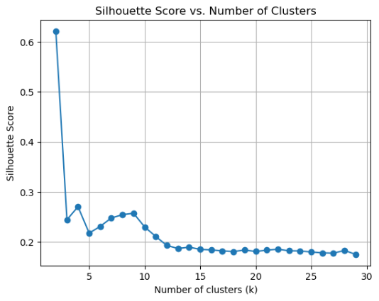

# Do Financial and Macroeconomic Features Predict Equity Crowdfunding Outcomes?

## Objective
Using a range of ML models applied to Reg CF Form C dataset, the objective of this study is to evaluate and compare whether theoretically grounded financial and macroeconomic information adds predictive value beyond basic crowdfunding characteristics; thereby providing insights into the role of these feature groups in shaping investor decision-making in equity CF.

## Target Variable
The target variable represents the CF outcome, where 1 and 0 are used to indicate successful and failed CF offering, respectively. A successful offering is defined as offerings that are able to reach or exceed the offering target before or at the offering deadline. Otherwise, the offering is classified as a failure. This definition is used because CF offerings under Reg CF are all under the All-or-Nothing model.

## Feature Selection
Feature selection will be taking on literature review approach to ensure that the selected variables are grounded in established theoretical and empirical findings. This approach reduces the risk of including irrelevant or spurious predictors.

<b> Historical Financial Features </b>
| Feature Name          | Description                                                                                                                                                                                                                                                                                                                                                   | Paper                                                                                               |
|-----------------------|---------------------------------------------------------------------------------------------------------------------------------------------------------------------------------------------------------------------------------------------------------------------------------------------------------------------------------------------------------------|-----------------------------------------------------------------------------------------------------|
| Working Capital       | Firm’s short-term liquidity position, computed as: $\text{Working Capital} = \text{Cash} + \text{Accounts Receivable} - \text{Short Term Debt}$                                                                                                                                                                      | Nitani et al. (2019)                                                                               |
| Revenue               | Total revenue from the most recent fiscal year                                                                                                                                                                                                                                                                                                                  | Kleinert et al. (2020); Ahlers et al. (2015); Nitani et al. (2019); Signori & Vismara (2018)       |
| Revenue Growth        | Revenue growth from prior to current fiscal year, computed using log growth: $g_t = \log(1 + R_t) - \log(1 + R_{t-1})$, where $R_t$ is revenue at fiscal year $t$.                                                                                                                                                    | Aland et al. (2024)                                                                                |
| Return on Asset (ROA) | Ratio between net income and total assets: $ROA = \dfrac{\text{Net Income}}{\text{Total Assets} + 10^{-10}}$ (small constant avoids division by zero when assets = 0)                                                                                                                                                                                      | Cumming et al. (2025)                                                                             |
| Asset                 | Total assets from the most recent fiscal year                                                                                                                                                                                                                                                                                                                   | Abrams (2017); Nitani et al. (2019); O’Reilly et al. (2023)                                        |
| Cash                  | Total cash and cash-equivalents from the most recent fiscal year                                                                                                                                                                                                                                                                                                | Abrams (2017); O’Reilly et al. (2023)                                                              |
| Cash Runway           | Length of time (in months) a company can continue operations before running out of cash: $\text{Cash Runway (months)} = \dfrac{\text{Current Cash Balance}}{\text{Monthly Net Burn Rate} + 10^{-10}}$  where $\text{Monthly Net Burn Rate} = \dfrac{\text{Cash Outflows} - \text{Cash Inflows}}{\text{Time (months)}}$.  Due to dataset limits: $\text{Cash Outflows} - \text{Cash Inflows} \approx -\text{Net Profit}$ *(limitation: ignores non-cash items & timing)* | n/a                                                                                                 |
| Long-Term Debt        | Total long-term debt (maturity > 1 year) from the most recent fiscal year                                                                                                                                                                                                                                                                                       | Abrams (2017)                                                                                      |
| Debt-to-Asset Ratio   | Proportion of assets financed by debt: $\text{Debt-to-Asset Ratio} = \dfrac{\text{Total Debt}}{\text{Total Assets} + 10^{-10}}$                                                                                                                                                                                                                              | Cumming & Hornuf (2022)                                                                            |
| Net Income            | Net income from the most recent fiscal year                                                                                                                                                                                                                                                                                                                     | Wright & Wright (2021); Cumming, Johan, & Reardon (2021); Nitani et al. (2019); Knyazeva & Ivanov (2017) |
| Gross Profit          | Gross profit from the most recent fiscal year                                                                                                                                                                                                                                                                                                                   | n/a                                                                                                 |
| Net Profit Margin     | Ratio between net profit and revenue: $\text{Net Profit Margin} = \dfrac{\text{Net Profit}}{\text{Revenue} + 10^{-10}}$                                                                                                                                                                                                                                      | Nitani et al. (2019); Lukkarinen (2016)                                                            |
| Gross Margin          | Ratio between gross profit and revenue: $\text{Gross Margin} = \dfrac{\text{Gross Profit}}{\text{Revenue} + 10^{-10}}$                                                                                                                                                                                                                                       | n/a                                                                                                 |

<b> Macroecnomic Features </b>
| Feature Name                       | Description                                                                                                  | Paper                                         | Data Source                                     |
|------------------------------------|--------------------------------------------------------------------------------------------------------------|-----------------------------------------------|------------------------------------------------|
| Unemployment Rate                  | Annual state-level unemployment rate, corresponding to the year of the CF start                              | n/a                                           | Federal Reserve Economic Data (FRED)           |
| Interest Rate                      | 30-day average of 10-year U.S. government bond yield, up to the start of the offering                        | Hsieh & Vu (2021)                             | FRED                                           |
| Inflation Rate                     | 12-month percentage change in CPI for the Census Region of the issuer, measured at the start of the offering  | Ekici & Aytürk (2023); Hsieh & Vu (2021)      | U.S. Bureau of Labor Statistics (BLS)          |
| Expected Change in Unemployment    | Country-level expected change in unemployment over the next year                                              | n/a                                           | Surveys of Consumers – University of Michigan  |
| Expected Change in Interest Rate   | Country-level expected change in interest rate over the next year                                             | n/a                                           | Surveys of Consumers – University of Michigan  |
| Expected Change in Price           | Country-level expected change in price over the next year                                                     | n/a                                           | Surveys of Consumers – University of Michigan  |
| Economic Policy Uncertainty (EPU)  | State-level monthly Composite EPU Index                                                                       | Hsieh & Vu (2021)                             | Economic Policy Uncertainty                    |
| Consumer Sentiment                 | Country-level monthly Consumer Sentiment Index                                                                | Nguyen et al. (2025)                          | Surveys of Consumers – University of Michigan  |
| VIX Index                          | Value of the VIX index at the start of the offering                                                           | Hayes et al. (2020); Donovan (2021)           | Yahoo Finance                                  |
| S&P500 Return                      | 30-day average of daily S&P500 returns up to the start of the offering                                        | Hsieh & Vu (2021)                             | Yahoo Finance                                  |
| Gini Index                         | Monthly country-level Gini index, corresponding to the year of the CF start                                   | Felipe et al. (2022)                          | SHADAC                                         |
| Geopolitical Risk (GPR)            | Monthly country-level GPR index, corresponding to the year of the CF start                                    | Alsagr et al. (2023)                          | Matteo Iacoviello                              |
| House Pricing Index (HPI)          | Quarterly state-level HPI index, corresponding to the year of the CF start                                    | Janků & Kučerová (2018)                       | Federal Housing Finance Agency (FHFA)          |

<b> Issuer Characteristics Features </b>
| Feature Name          | Description                                                                                                                                           | Paper                                                                                       |
|-----------------------|-------------------------------------------------------------------------------------------------------------------------------------------------------|---------------------------------------------------------------------------------------------|
| Development Phase     | Issuer’s development stage, classified using unsupervised clustering models                                                                           | Wright & Wright (2021)                                                                      |
| Company Age           | Company age (in days)                                                                                                                                 | Cumming et al. (2025); Vu & Christian (2023); Nitani et al. (2019)                          |
| Past CF Success       | Number of successful past CF offerings by the same issuing company                                                                                    | Kleinert et al. (2020); Usman et al. (2019); Li & Martin (2019); Shafi (2021)               |
| Past CF Failure       | Number of failed past CF offerings by the same issuing company                                                                                        | Li & Martin (2019); Zunino et al. (2022)                                                    |
| Past Person Success   | Number of successful past CF offerings by the same issuing person (campaign lead/representative of the issuing company)                               | Zunino et al. (2022); Kuppuswamy & Bayus (2018)                                             |
| Past Person Failure   | Number of failed past CF offerings by the same issuing person                                                                                         | Li & Martin (2019); Zunino et al. (2022)                                                    |
| Total Employees       | Number of employees currently employed by the issuer                                                                                                  | Cumming et al. (2025); Ahlers et al. (2015); Nitani et al. (2019)                           |
| Delaware Incorporated | Boolean indicator for whether the company is incorporated in Delaware                                                                                 | Cumming et al. (2025)                                                                       |

<b> CF Characteristics Features </b>
| Feature Name              | Description                                                                                                                                                                                                                   | Paper                                                                                                 |
|---------------------------|-------------------------------------------------------------------------------------------------------------------------------------------------------------------------------------------------------------------------------|-------------------------------------------------------------------------------------------------------|
| Minimum Investment Size   | Price per unit of the security offered                                                                                                                                                                                        | Lukkarinen et al. (2016); Ahlers et al. (2015); Fricke et al. (2021)                                 |
| Platform Commission Fee   | Platform fee (%), calculated as a percentage of the total amount raised                                                                                                                                                       | Cumming et al. (2025)                                                                                |
| Platform Equity Stake Fee | Platform equity stake fee (%), expressed as a percentage of the total number of securities issued in the CF offering                                                                                                          | Johan & Reardon (2024); Cumming et al. (2025)                                                        |
| Platform Popularity       | Popularity of the intermediary platform, measured as the relative share of successful CF offerings facilitated by the platform over the 12 months preceding the start date of the given CF offering                           | Cumming et al. (2025); Knyazeva & Ivanov (2017); Belleflamme et al. (2016)                           |
| Offering Duration         | CF campaign duration, measured in days                                                                                                                                                                                         | Mollick (2014); Lukkarinen et al. (2016); Vismara (2016); Janků & Kučerová (2018); Härkönen (2014)   |
| Total Competitors         | Number of competing Reg CF offerings active at the start date of the campaign                                                                                                                                                  | Janků & Kučerová (2018); Dorfleitner et al. (2018); Vismara (2018)                                   |
| Local Competitors         | Local CF competition, measured as the number of active CF offerings in the state where the issuer operates, at the start date of the campaign                                                                                   | Janků & Kučerová (2018); Mollick (2014)                                                              |
| Target Offering Amount    | Target offering amount set by the issuer                                                                                                                                                                                       | Cumming et al. (2025); Mollick (2024); Ralcheva & Roosenboom (2020); Hakenes & Schlegel (2014)       |
| Type of Security Offered  | Type of security offered in the campaign: Equity, debt, SAFE, or other                                                                                                                                                         | Cumming, Johan, & Reardon (2021)                                                                     |
| Pricing Methodology       | Boolean indicator of the pricing methodology: Arbitrary pricing (0) or systematic pricing (1)                                                                                                                                  | Clough et al. (2019); Nitani et al. (2019)                                                           |
| COVID-19 Period           | Boolean indicator of whether the offering starts during or outside the defined COVID-19 pandemic period (March 2020 to June 2021)                                                                                              | n/a                                                                                                   |
| Reg CF Regulatory Amendment | Boolean indicator of whether the offering starts after or before the Reg CF amendments implemented on March 26, 2021                                                                                                         | Cumming, Johan, & Reardon (2021)                                                                     |

<b> Georgraphical and Demographic Features </b>
| Feature Name                | Description                                                                                                                                                                                                                  | Paper                                    | Data Source                         |
|-----------------------------|------------------------------------------------------------------------------------------------------------------------------------------------------------------------------------------------------------------------------|------------------------------------------|-------------------------------------|
| Total Population            | Total population of the state in which the issuer primarily operates                                                                                                                  | Agrawal et al. (2011)                     | FRED                                |
| Creative Workforce          | Creative workforce density at the state level, calculated as the ratio of workers employed in “Arts, Design, Entertainment, Sports, and Media Occupations” to the total workforce in the state | Mollick (2014)                           | Bureau of Economic Analysis (BEA)    |
| Rural-Urban Continuum Code (RUCC) | A measure of the degree of rurality or urbanization for a state. Computed as the population-weighted average of county-level RUCC values at the state level                            | Maymoni & Solodoha (2025); Carbonara (2020) | United States Department of Agriculture (USDA) |
| Population Age              | Median age of the state’s population                                                                                                                                                                                         | Felipe et al. (2022)                     | U.S. Census Bureau                  |
| Income Level                | Personal income per capita in the state                                                                                                                                                                                       | Igra et al. (2021)                       | BEA                                 |
| Education Level             | Proportion (%) of individuals aged 25 or older in the state who have attained at least a bachelor’s degree                                                                                                                    | Igra et al. (2021)                       | FRED                                |

## Feature Transformation and Scaling
For Boolean features, no transformation or scaling is applied. Categorical features are transformed using one-hot encoding, which converts each category into a separate binary column. Finally, numerical features, by contrast, are first transformed and then scaled to address skewness and heavy-tailed distributions, which can distort model performance, particularly in distance-based algorithms such as K-means, which will later be used for clustering.

Numerical features are transformed using the inverse hyperbolic sine (arcsinh) function. The arcsinh transformation is chosen because of its favorable characteristics. First, it is defined at zero (with arcsinh(0) = 0). Second, it behaves almost linearly near zero, which is especially useful when dealing with ratios, such as the debt-to-asset ratio, where the numerators are typically smaller than the denominator. Third, arcsinh compresses extreme positive and negative values, reducing the impact of extreme outliers. Lastly, it is odd symmetrical around the origin (i.e. arcsinh(-x) = - arcsinh(x)), making it robust when handling features that can take both positive or negative value.

Next, numerical features are scaled using Robust Scaling, as shown in the formula below. This method is well-suited for handling outliers, as it centers the data using the median and scales it based on the interquartile range (IQR). By doing so, it preserves the relative differences within the central portion of the data distribution while minimizing the influence of extreme values.

## Clustering Result

A feature will be generated that categorizes the issuers into their appropriate development stage. But rather than classifying them using hand-made rules, non-supervised ML model, namely K-mean clustering and hierarchical clustering, will be deployed. These two models use different assumptions and provide different perspectives. K-Means assumes that clusters are spherical. It is most optimal when all clusters have similar spread/variance and are equally sized (in terms of the number of data points). In contrast, hierarchical clustering makes no assumptions related to the shape of the clusters. It can capture more complex structures, e.g. it can reveal nested structures (such as a “scaling” group that further subdivides into “efficient scaling” and “strained scaling”), reflecting the reality that development phase is continuum, not just isolated blobs.
Note that the clustering process will only be using features that directly capture a company’s maturity and financial profile. The selected features include,
- Revenue: It is a primary indicator of a company’s operational activity. It helps distinguish between pre-revenue and post-revenue companies, and higher revenue levels generally indicate greater market traction and operational scale.
- Revenue Growth: This metric captures the trajectory of the company. A high growth rate suggests that the firm is in an active scaling phase. 
-	Net Profit Margin and Gross Profit Margin: These profitability metrics are crucial for understanding operational efficiency and sustainability. Gross profit margin reflects how efficiently a company produces its goods or services, while net profit margin accounts for all expenses. Early-stage firms often exhibit negative margins due to reinvestment and development costs, whereas later-stage firms may show improved margins.
-	Total Asset and Number of Employees: These serve as proxies for the scale and complexity of the business. It helps to differentiate between lean startups and well-resourced companies.
-	Company Age: Younger companies are more likely to be in the pre-revenue or growth phase, while older firms are more likely to have an established position in the market.

<b>Fig. 1.</b> Hierarchical Clustering Dendogram with Average Linkage: Optimal cut at two clusters with 3548 data points in the first cluster and 15 in the second cluster.

<b>Fig. 2.</b> Hierarchical Clustering Dendogram with Complete (Maximum) Linkage: Optimal cut at two clusters with 3513 data points in the first cluster and 50 in the second cluster.

<b>Fig. 3.</b> Hierarchical Clustering Dendogram with Centroid Linkage: Optimal cut at two clusters with 3548 data points in the first cluster and 15 in the second cluster.

For the hierarchical clustering algorithm, clustering was performed using multiple linkage methods to compute inter-cluster distances, including average linkage, complete linkage (maximum distance), and centroid linkage. The resulting dendrograms are shown in the diagrams above. In all cases, the dendrograms indicate an optimal cut at two clusters, corresponding to the largest vertical distance between successive merges (i.e., the largest linkage gap). However, this solution produces highly imbalanced cluster sizes. Alternative cuts based on the second- and third-largest linkage gaps were also tested, but the resulting clusters remained substantially imbalanced.

For K-means clustering, multiple runs are performed with varying numbers of clusters (K) to identify the optimal clustering solution. For each iteration, inertia and silhouette scores are calculated, and scree plots of both metrics are generated to guide the selection of K, as shown in the figures below,

<b>Fig. 4.</b> Scree plot of the inertia score.

<b>Fig. 5.</b> Scree plot of the silhouette score.

To determine the appropriate number of clusters from the inertia score scree plot, the “elbow” method is typically used. In this case, however, no distinct elbow is observed, making it difficult to identify an optimal K based on inertia alone. Therefore, the silhouette score scree plot was examined instead. The highest silhouette score occurs at K = 2, suggesting two clusters as the optimal solution. However, this configuration produces a highly imbalanced distribution (3,474 data points in one cluster and 89 in the other). Consequently, the second-highest silhouette score, observed at K = 4, was selected. This choice yields a more balanced distribution, with cluster sizes of 1,523; 1,200; 757; and 83, respectively, as well as each of the 4 clusters are interpretable. The details for each cluster is presented in the table below,

<b>Fig. 6.</b> The mean value of features in each of the 4 clusters derived from K-Means clustering.

The issuers in each cluster can be described as follows, in which these clusters will be included in the Basic feature set,
-	Group 1 (Established): This group consists of large-sized companies that have secured a well-established position in the market, as reflected by their high total assets, large employee base, and substantial revenue generation. These companies have also achieved operational efficiency, evidenced by their positive gross profit margins, indicating that their core products or services are economically viable. However, despite this operational strength, they are generally loss-making, as reflected in their negative average net profit margins.
-	Group 2 (Scaling with Operational Strain): This group consists of moderately sized companies that are focusing on expanding their market share, as reflected by the strong revenue growth. However, to fuel this growth, they likely engage in significant reinvestment, such as aggressive marketing or customer acquisition spending. Moreover, the negative gross margin points to either operational inefficiencies or early-stage pricing strategies. These two factors explain the large negative net profit margin observed in this cluster.
-	Group 3 (Scaling with Operational Efficiency): This group consists of mid-sized companies that are focusing on expanding their market share, as reflected by the strong revenue growth. Similar to Group 2, they likely incur significant reinvestment to support this expansion. However, their net profit margin is not as negative as in Group 2 because entities in this group have a positive gross margin, indicating that their core operations are economically viable. Moreover, they exhibit higher revenue growth than Group 2.
-	Group 4 (Early-Stage): It consists of very early ventures with a good majority of entities in the cluster are at pre-revenue level. Companies at this stage incur a lot of expenses related to R&D, in which when combined with low or no revenue stream, these companies suffer from large losses.

## Cross-Validation
K-Fold cross-validation will be employed to evaluate model performance in a robust and unbiased manner. The K-Fold method begins by partitioning the entire dataset into K equally sized subsets, commonly referred to as “folds.” The model training and evaluation process is then repeated K times. In each iteration, one of the K folds is held out as the validation (testing) set, while the remaining K – 1 folds are used to train the machine learning model. This ensures that each of the K folds is used exactly once as the validation set.

After all K iterations are completed, performance metrics are calculated on each of the K validation sets. These K individual metric values are then averaged to produce a final aggregated performance estimate. Note that in this study, 5-Fold cross-validation will be used during hyper-parameter tuning, model calibration, performance evaluation, and SHAP analysis.

## Hyper-parameter Tuning and Model Calibration
Hyperparameter tuning is conducted to identify the optimal hyperparameter configuration for each model and feature set combination, using 5-fold cross-validation.

Tuning is performed using random search, with binary cross-entropy (also known as log loss) as the scoring metric to guide model selection. Binary cross-entropy is chosen over threshold-based metrics (e.g. accuracy, F1-score) because it provides a more fine-grained evaluation of predictive performance. Unlike classification metrics that rely on hard thresholding (e.g. assigning a class label based on a 0.5 cutoff), log loss penalizes predictions based on how far the predicted probability deviates from the true class label, where the closer the predicted probability is to the correct class, the smaller the loss incurred.

However, when using log loss, the predicted probabilities (i.e. model outputs) must be well-calibrated, which is not always the case. Many models, such as SVMs, Random Forests, and Gradient Boosted Trees (e.g. XGBoost), produce poorly calibrated probabilities. As noted by Niculescu-Mizil and Caruana (2005), these models tend to face difficulty in producing probability that is close to 0 and 1. In contrasts, logistic regression and NNs produces well-calibrated probability predictions. This issue can be addressed by performing probability calibration, where SVMs, random forests, and gradient-boosted trees are models that benefit the most from probability calibration (Niculescu-Mizil & Caruana, 2005). And therefore, calibration will only be performed on these three models.

To calibrate the models, Platt scaling (also known as sigmoid calibration) is applied. Platt scaling involves fitting a logistic regression model with the output probabilities of the base model (i.e. the uncalibrated model) as the independent variable and the true label as the target variable. The resulting logistic regression transforms the raw scores into calibrated probabilities.

## Results
After hyper-parameter tuning is performed, each model was retrained using its tuned hyper-parameters, and performance was evaluated using 5-fold cross-validation.

<b>Fig. 7.</b> Ablation Analysis: ML models’ prediction performance.

| Feature Set        | Logistic Regression (Acc / Macro F1) | SVM (Acc / Macro F1) | Random Forest (Acc / Macro F1) | XGBoost (Acc / Macro F1) | FNN (Acc / Macro F1) |
|--------------------|---------------------------------------|-----------------------|--------------------------------|--------------------------|----------------------|
| Basic              | 73.98% / 73.93%                      | 75.95% / 75.90%      | 77.66% / 77.64%                | 78.87% / 78.86%          | 77.07% / 76.97%      |
| Basic + Financial  | 73.62% / 73.58%                      | 76.14% / 76.11%      | 78.28% / 78.26%                | 78.98% / 78.97%          | 78.11% / 78.07%      |
| Basic + Macroecon. | 74.01% / 73.97%                      | 75.89% / 75.85%      | 78.11% / 78.09%                | 78.92% / 78.91%          | 77.66% / 77.62%      |
| All                | 73.76% / 73.73%                      | 76.06% / 76.03%      | 78.56% / 78.53%                | 79.37% / 79.35%          | 77.04% / 76.98%      |

The table above reports the accuracy and macro F1-scores of the five ML models across four progressively enriched feature sets. Several key patterns emerge from the result. First, XGBoost consistently achieved the highest accuracy (and macro F1-score) across all feature sets, with results ranging from 78.87% (78.86%) for the Basic features to a peak of 79.37% (79.35%) when all features were included. This result underscores the strength of gradient boosting in modelling complex, non-linear relationships and feature interactions.

Second, Random Forest was the second-best performer, outperforming the remaining three models across all feature sets in both metrics. Like XGBoost, it achieved its best results on the complete feature set and its lowest scores on the Basic feature set, with accuracy (macro F1-score) ranging from 77.66% (77.64%) to 78.56% (78.53%).

Third, among the remaining models, FNN consistently outperformed SVM and Logistic Regression, achieving its highest accuracy (78.11%) and macro F1-score (78.07%) with the “Basic + Financial Features” dataset. SVM performed best with the “Basic + Financial Features” configuration, while Logistic Regression trailed behind across all feature sets.

Regarding the impact of adding Financial and Macroeconomic features to the Basic set, the results are mixed. In most cases, the additional features produced marginal improvements (generally under 1%), though slight performance declines were observed in some configurations (particularly in the simpler models, such as logistic regression and SVM). The most notable performance improvements across feature sets were as follows:
-	Basic vs. Basic + Financial feature sets: The largest gain was observed in FNN, with +1.04% accuracy and +1.10% macro F1-score.
-	Basic vs. Basic + Macroeconomic feature sets: Again, FNN showed the largest improvement, with +0.59% accuracy and +0.65% macro F1-score.
-	Basic vs. Complete feature sets: The largest improvement was seen in Random Forest, with +0.90% accuracy and +0.89% macro F1.

Given the minimal performance improvements, these findings indicate that the Basic features already capture most of the predictive signal, and the Financial and Macroeconomic features contribute limited additional predictive information beyond the baseline features.

Additionally, across all models with the exception of the logistic regression model, training with Basic + Financial features resulted in slightly better performance than with Basic + Macroeconomic features. This suggests that the financial features carry slightly stronger predictive value. However, these performance differences were minimal, suggesting that this observation may not stand across different datasets or model tuning.

SHAP analysis was then performed to clarify whether the limited improvements in predictive performance observed in the ablation study are due to a lack of inherent signal. Moreover, it could potentially identify certain financial and macroeconomic features that might still be influential to the model predictions.

The SHAP analysis was performed using the best performing model on each feature set. The top 20 features with the highest mean absolute SHAP values for each of the four feature sets, derived from the best performing models, are as detailed in the charts below,

<b>Fig. 8.</b> Top 20 features ranked by mean absolute SHAP values, from the XGBoost model trained on the Basic feature set, with values computed using 5-fold cross-validation.

<b>Fig. 9.</b> Top 20 features ranked by mean absolute SHAP values, from the XGBoost model trained on the Basic + Financial feature set, with values computed using 5-fold cross-validation.

<b>Fig. 10.</b> Top 20 features ranked by mean absolute SHAP values, from the XGBoost model trained on the Basic + Macroeconomic feature set, with values computed using 5-fold cross-validation.

<b>Fig. 11.</b> Top 20 features ranked by mean absolute SHAP values, from the XGBoost model trained on the Basic + Financial + Macroeconomic feature set, with values computed using 5-fold cross-validation.

Across all four feature sets, the top three predictors are identical, in the order of, offering target amount, pricing methodology, and platform popularity. All three originate from the Basic feature set, specifically within the CF characteristics group (i.e. campaign design and platform characteristics). Their dominance, with large margins over all other features, demonstrates that neither financial nor macroeconomic features displace these existing key predictors.

When extending the analysis to the top eight features, the set remains unchanged across all four feature sets, with only minor changes in ordering. These features include target offering, pricing methodology, platform popularity, equity stake fee, duration, commission fee, debt security (as the type of instrument offered), and minimum investment size. Again, every one of these features comes from the CF characteristics group of the Basic feature set, reinforcing that the model’s predictive signal is heavily concentrated in a small cluster of campaign- and platform-related variables. Notably, the Issuer Characteristics features and the Geographic & Demographic features (both subgroups of the Basic feature set) are entirely absent from the top 8, indicating their weak predictive power. Moreover, none of the Development Phase features, derived from the clustering model, appear in the top 20 predictors, which is consistent with the finding that backers largely disregard issuer financial disclosures as the features used in clustering were primarily based on the issuer’s financial metrics.

A closer comparison of SHAP values between the Basic and Basic + Financial feature sets shows that introducing financial variables brings net income and total assets into the top 10, ranked 9th and 10th, respectively. However, their SHAP values (~0.02) are an order of magnitude smaller than the leading basic predictor (~0.25), underscoring their limited marginal contribution. In contrast, in the Basic + Macroeconomic feature set, no macroeconomic variable enters the top 10. The highest-ranked is the S&P 500 return at 12th place (SHAP ~0.015), followed by interest rates (~0.009), in which both remain far below the influence of the dominant basic predictors.

Finally, looking at the SHAP result from the complete feature set, the financial and macroeconomic features remain contributing minimally to model prediction, with the net income feature as the non-Basic feature with the largest SHAP value (~0.02), far lower than the top-ranked Basic features. Furthermore, the average SHAP value of the financial features in this feature set is 0.0099, while the macroeconomic features averaged 0.0083. This indicates that, on average, financial metrics contribute slightly more to model predictions than macroeconomic metrics. Nonetheless, the small difference in mean SHAP values (~0.0016) underscores the need for caution, because under different conditions (i.e. model tuning and/or dataset), the relative ranking between the two groups could easily reverse.

Next, the standalone feature group analysis was performed. The results in table below show that financial-only features consistently outperform macroeconomic-only features across all models. Models trained exclusively on financial features reached accuracies and macro F1-scores of ~54–56%, whereas macroeconomic-only models performed worse, with accuracies of ~49–54% and macro F1-scores of ~36–55%. These findings reinforce the ablation and SHAP analyses, where financial disclosures carry slightly more predictive value than macroeconomic conditions. However, both groups remain weak as standalone predictors, as their performance is substantially lower than that of models trained on the Basic feature set alone.

<b>Fig. 12.</b> Standalone Feature Group Analysis: ML models’ prediction performance.

| Feature Set    | Logistic Regression (Acc / Macro F1) | SVM (Acc / Macro F1) | Random Forest (Acc / Macro F1) | XGBoost (Acc / Macro F1) | FNN (Acc / Macro F1) |
|----------------|---------------------------------------|-----------------------|--------------------------------|--------------------------|----------------------|
| Financial      | 54.56% / 54.53%                      | 55.63% / 55.58%      | 55.68% / 55.21%                | 55.32% / 54.86%          | 55.57% / 54.62%      |
| Macroeconomic  | 53.18% / 53.16%                      | 52.20% / 36.58%      | 49.09% / 41.58%                | 50.30% / 39.17%          | 54.39% / 50.50%      |

Given that the net income and total assets exhibit the greatest predictive value compared to the other financial features and the S&P500 returns and interest rates are the most influential macroeconomic features, we will dive deeper using SHAP beeswarm plots to see their directional behavior in more details. The SHAP beeswarm plots are generated using the complete feature set. This choice is motivated by the fact that the directional behavior of financial and macroeconomic features is consistent across the complete, Basic + Financial, and Basic + Macroeconomic feature sets. The beeswarm plot is presented below,

<b>Fig. 13.</b> SHAP beeswarm plot of the top 20 features ranked by mean absolute SHAP values, based on the XGBoost model trained on the Basic + Financial + Macroeconomic feature set, with values computed using 5-fold cross-validation.

In terms of the key financial features, the beeswarm plot reveals that net income displays a negative association with the probability of CF success, indicating that campaigns from issuers with lower net income are more likely to succeed. By contrast, total assets exhibit a positive relationship, suggesting that larger asset bases are associated with higher success probabilities. With respect to macroeconomic factors, the interest rate demonstrates an inverse relationship with CF success probability, while the S&P 500 return is generally positively associated, where more favorable equity market conditions are linked to greater campaign success.

Briefly, the top basic predictors in the beeswarm plot show that the offering target is negatively associated with success, while platform popularity and CF duration are positively associated with success. Interestingly, the use of an arbitrary pricing methodology also emerges as a positive contributor to CF success.
